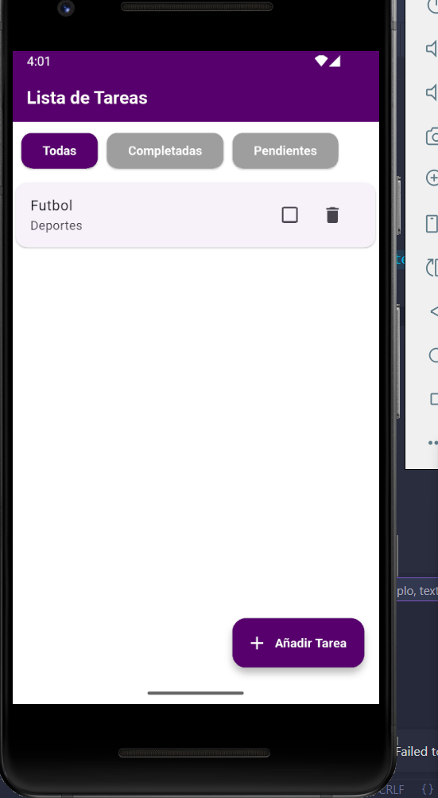
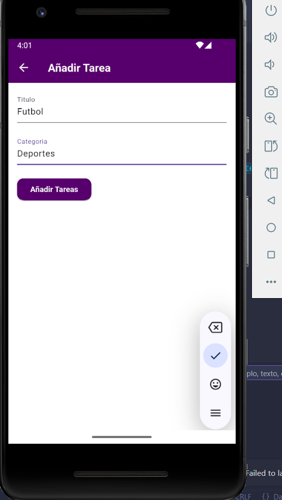

# 📝 TodoList

Una mini aplicación desarrollada con **Flutter** y **Dart** que permite gestionar tareas de forma sencilla y eficiente. Está orientada a ser una herramienta práctica para llevar el control de tareas diarias, con funciones básicas como agregar, editar, completar y eliminar tareas.

## 🚀 Características

- ➕ Añadir nuevas tareas
- ✏️ Editar tareas existentes
- ✅ Marcar tareas como completadas mediante un checkbox
- ❌ Eliminar tareas no deseadas
- 🔍 Filtros para mostrar:
  - Todas las tareas
  - Solo tareas completadas
  - Solo tareas pendientes

## 📱 Plataforma

- Probado en **Android**

## 📸 Capturas de pantalla

### 🏠 Pantalla Principal



### ➕ Añadir Tarea




## 🛠️ Tecnologías Utilizadas

- [Flutter](https://flutter.dev/) 3.x
- [Dart](https://dart.dev/) 3.x

## ⚙️ Instalación

1. Clona el repositorio:
   ```bash
   git clone https://github.com/breinergg/todo-list-app.git

## 👨‍💻 Autor

**Breiner González Machado**
- 📧 Email: breinerftwyts@gmail.com

